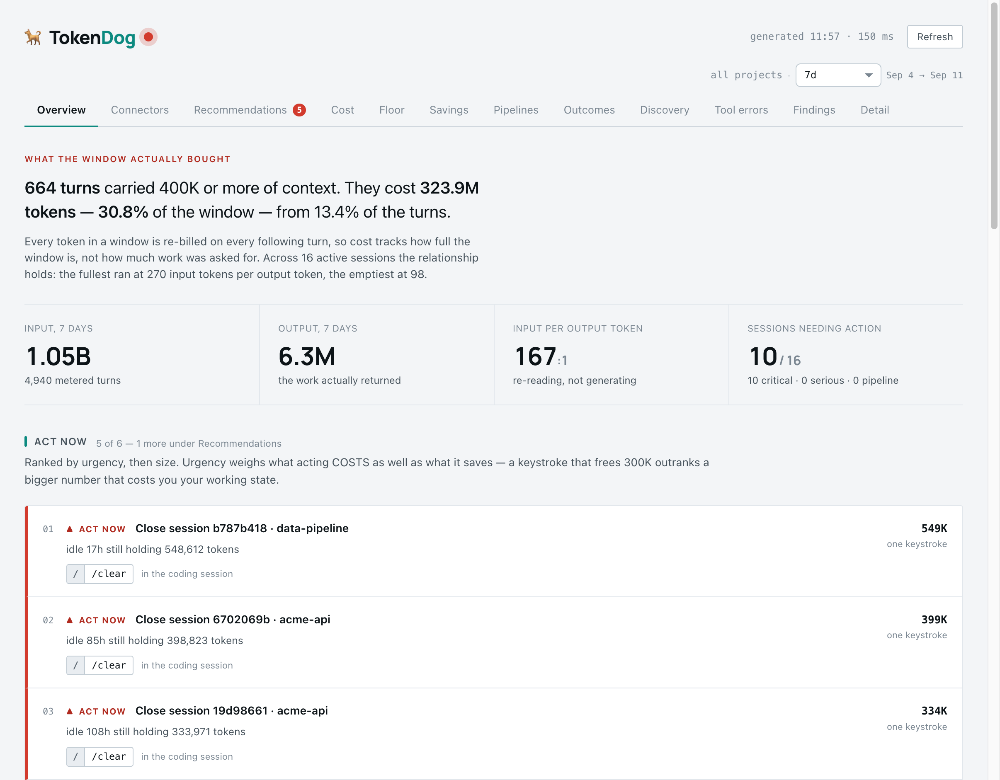

# TokenDog 🐕

**The watchdog for your coding-agent token spend.** Measure it, then reduce it —
org-wide, without losing output quality. Deterministic core, no ML hand-waving.

<p align="center">
  
  <br><sub>Rendered from synthetic transcripts. Project names, session ids and figures are invented.</sub>
</p>

> Status: **0.2.0**, measurement is the product. It prices what your sessions cost from
> authoritative usage and tells you which sessions to close. The reduction features are
> opt-in, off by default, and honest about what they measured on a real workload.

## What it does

- **Measures** token cost from authoritative usage — Claude Code transcripts (and, optionally,
  Glitch's stop hook) — attributed by project / tool / model / entrypoint / context band.
- **Reduces** spend in the order the bill is actually incurred — **carry less** (context re-read on
  every turn), **rewrite less** (cache writes when the prefix churns), then **generate less**
  (output). Via the tool-output condenser, session hygiene, budgets + alerts, config templates,
  and MCP-author helpers.

### Where the money goes

Measured over one developer's 19,466 metered turns (6.33B tokens, $4,884) across 255 transcripts:

| Bucket | % of tokens | % of cost |
|---|--:|--:|
| Cache read | 97.4% | **62.2%** |
| Cache write | 2.3% | **28.9%** |
| Output | 0.3% | **8.9%** |
| Fresh input | 0.0% | 0.0% |

Roughly nine-tenths of the bill is context economics: how much you carry, and how often you make
the model pay to rebuild it. Output — the thing most token advice is about — is the last ninth. A
token carried for 50 turns costs more on Opus than a token generated once, and here 50.9% of turns
ran at ≥200k context and carried 84.4% of all context tokens.

`Est $` is **API list-price attribution, not an invoice** — on a Pro/Max subscription there is no
per-token charge, so read it as relative weight. It is not a rate-limit proxy either: it applies
price weights (output 5× input, cache read 0.1×) that quota accounting does not.

Transcripts cover every project on the machine, so scope a report with `--project <name>` (the
project directory's basename); `tokendog doctor` lists the names it found.

Those are one machine's numbers; a second seat showed the same ordering with output nearer 15%.
Run `tokendog cost` and `tokendog bands` on your own history before believing any of it — that is
what the measurement half is for. Details in `docs/FEATURES.md`.

## Layers (each independently useful)

- **`src/tokendog/` + `tokendog-plugin/`** — the Python package and agent plugin: telemetry hook,
  cost MCP, frugal + hygiene skills, and slash commands `/tokendog:cost` `:doctor` `:budget` `:audit` `:init`.
- **Local dashboard** (`tokendog serve`) — the same figures as a page (see [Dashboard](#dashboard)),
  in tabs: Overview (window occupancy, daily trend, ranked act-now list), Connectors, Recommendations,
  Cost (the four billing buckets by model + per-tool payload), Pipelines (Claude spend per Glitch
  pipeline), Outcomes (cost per merged PR), Tool errors, Findings, and a per-session Detail drawer.
  One global range control (Today / Yesterday / 7d / 14d / 30d / 90d / All) scopes every tab; each
  headline compares against the previous window of the same length. Colourblind-safe by construction
  (status is shape + word, never colour alone). Standard-library HTTP, loopback-bound, no web framework.
- **Context surface** (`tokendog surface`) — what every prompt carries before the conversation
  starts, grouped by connector because that is the unit you can switch off. Names the connectors
  that are resident on every turn and never called, and the idle tools inside the ones you do use.
  `--disable` turns one off: dry run by default, backed up, reversible.
- **Statusline** (`tokendog-plugin/scripts/statusline.py`) — what this window is carrying and
  what to do about it, on screen while you work. Registered by `tokendog init`. See
  [The statusline](#the-statusline).
- **`tokendog-templates/`** — drop-in `CLAUDE.md` + `settings.json` baselines (`tokendog init`), with an
  extension marker that preserves your org's customizations across updates.
- **`tokendog-mcp-toolkit/`** — the `tokendog_mcp` package: pagination, truncation, batch-dedup, dense
  schemas, and deferred tool loading for MCP authors.
- **`docs/`** — the mkdocs site (quickstart, how it works, extending, FAQ) and the feature inventory.
- **`benchmarks/`** — a reproducible token-savings harness.
- **`tokendog-gate/`** — **experimental, unwired** Rust transport-gate transforms. No proxy exists and
  nothing calls them; measured against a real workload they would have invalidated the prompt cache
  and cost more than they saved. Kept as tested code for a workload where that is not true.

## Quickstart

```bash
pip install -e ".[dev]"
python -m pytest -q                 # Python suite
python -m benchmarks.run            # token-savings benchmark

# In the agent:
#   /plugin marketplace add .        # the repo root ships .claude-plugin/marketplace.json
#   /plugin install tokendog@tokendog
#   tokendog init                    # drop frugal CLAUDE.md + settings into your repo
#   ... run a session ...
#   /tokendog:cost                   # see your spend (4 buckets, not one total)
#   /tokendog:bands                  # see WHERE the tokens are (context size)
#   tokendog cost --project myapp    # one project, not the whole machine
#   tokendog audit                   # payload volume per tool
#   tokendog hygiene                 # was each session managed, and what did drift cost
#   tokendog resumes                 # windows carried past the moment to reset them
#   tokendog coldstart               # discovery paid for more than once
#   tokendog surface                 # what is in the window before you type: connectors,
#                                    #   which of their tools you actually call, what is idle
#   tokendog surface --refresh       # start each connector to size its tool schemas
#   tokendog surface --disable NAME  # dry run; add --apply to make the edit (backed up)
#   tokendog session <id>            # turn-by-turn: what entered the window, and what it cost
#   tokendog session <id> --json     # ...as JSON, to hand to something else
#   tokendog install-hook           # stamp session id into commits → EXACT PR attribution
#   tokendog errors                  # which tools/MCP fail most, and how
#   tokendog pipelines               # Claude spend per Glitch pipeline (reads .glitch/runs)
#   tokendog discovery               # finding vs doing — flags the grep-loop sessions
#   tokendog floor                   # context floor budget: MCPs/skills/instructions, sized + used-or-not
#   tokendog outcomes                # cost per merged PR — links sessions→commits→PRs
#   tokendog outcomes --gh           # resolve PRs via GitHub CLI (squash-merge repos)
#   tokendog serve                   # all of it as a local page on 127.0.0.1:4320

# Any turn-measuring report takes a time range. This is the one to reach for when
# a limit has JUST gone: a rate limit is spent in minutes, and a calendar day is
# three orders of magnitude too coarse to see it.
#   tokendog hygiene --since 17:29 --until 17:45   # the sixteen minutes that did it
#   tokendog hygiene --since 19:20                 # everything since the bucket reset
#   tokendog bands   --since 90m                   # a span back from now
#   tokendog session <id> --since 17:29 --until 17:45
#   ...accepted by bands, resumes, coldstart, hygiene, surface and session.
#   Forms: 17:29 · 2026-09-08 · 2026-09-08T17:29 · 90m / 3h / 2d / 1w · today · yesterday
#   Clock times and dates are LOCAL. `--since 23:50` typed at 00:10 means ten
#   minutes ago, not a window in the future.

# Experimental Rust gate (not wired to anything):
cd tokendog-gate && cargo test
```

## Environment toggles

- `TOKENDOG_QUIET=1` — silence the end-of-turn spend summary (the `Stop says: TokenDog…` line). Token counting and budget alerts still run; only the message is muted.
- `TOKENDOG_STATUSLINE_FLOOR=0` — hide the **baseline** segment in the statusline (it is ON by default): the always-on tokens (MCP schemas + skills + instructions) that ride in every turn. It shows only until the session's own `setup` split is measured (after the first turn), which then replaces it. Use `tokendog floor` for the full itemised budget.
- `TOKENDOG_AUTO_REFRESH=0` — stop tokendog from auto-measuring MCP schema sizes. By default a SessionStart hook runs `surface --refresh` in the BACKGROUND when the inventory is missing/stale or a connector was added — so the statusline baseline and `tokendog floor` populate with no command to remember. It never blocks the session (detached, per-connector timeout) and changes no config.
- `TOKENDOG_ADVICE=0` — mute the once-a-day, per-project SessionStart notice that names MCP connectors never called *in this repo* and offers the reversible fix (the assistant runs it on your "yes" — you never type a command).
- `TOKENDOG_OBSERVE_ONLY=1` — the budget hook never denies a tool call, only watches.

## Dashboard

Everything the CLI reports, as one local page — most people only ever open this.

```bash
tokendog serve                 # binds 127.0.0.1:4320 by default
tokendog serve --port 4321     # if 4320 is taken (see the note below)
```

Then open **http://localhost:4320**. Tabs across the top — Overview, Connectors,
Recommendations, Cost, Pipelines, Outcomes, Tool errors, Findings, Detail — and a
single range control in its own row above them (Today / Yesterday / 7d … / All)
that scopes every tab and shows the exact from→to dates. Click any session id for
a turn-by-turn **drawer** (or its `json` link for the machine-readable view). The
git-backed tabs (Cost / Pipelines / Outcomes / Tool errors) compute lazily when you
first open them, so the page loads instantly.

**Viewing it from another machine.** The server binds loopback and is
**unauthenticated** — it exposes project names, session ids and token counts — so
don't expose it on a routable interface. To see a dashboard running on a remote box
(a build server, another laptop), forward the port over SSH and browse locally:

```bash
ssh -N -L 4320:127.0.0.1:4320 you@remote-host      # leave this running
#   then open http://localhost:4320 on your own machine
```

`--address 0.0.0.0` exists for the reverse-proxy case, but the SSH tunnel is the
safe default.

**"Errno 48 / Address already in use."** A `tokendog serve` is already holding the
port. Find and stop it, or use another port:

```bash
pkill -f "[t]okendog.report serve"      # the [t] stops pkill matching its own command
tokendog serve --port 4321
```

### Running without an editable install

On a box where you don't want to `pip install`, tokendog is pure standard library
(only `tiktoken` is optional, for exact payload sizing — it falls back to a byte
estimate). Point `PYTHONPATH` at `src` and run the module:

```bash
PYTHONPATH=/path/to/tokendog/src python3 -m tokendog.report serve --port 4320
# or a tiny launcher:
#   export PYTHONPATH="$HOME/tokendog/src"; export TOKENDOG_HOME="$HOME/tokendog/state"
#   python3 -m tokendog.report "$@"
```

### Exact PR / pipeline attribution (optional)

`tokendog outcomes` links sessions to merged PRs and `tokendog pipelines` links them
to Glitch pipeline runs. Both work heuristically out of the box; for **exact**
attribution, install the commit hook so each commit records the session that made it:

```bash
tokendog install-hook            # in a repo; adds a prepare-commit-msg hook (reversible: --remove)
```

## Safe-by-default rollout

A fresh install only **measures** — it never silently alters tool output. Adopt the one
content-altering feature, the condenser, in three steps:

```bash
# 1. Observe — install and work normally. Zero content alteration.
#    /plugin marketplace add . && /plugin install tokendog@tokendog
#                                        →   /tokendog:cost   (watch your spend)

# 2. Measure — see what the condenser WOULD cut, without changing anything:
export TOKENDOG_TRUNCATE_MODE=shadow
#    ... run some real sessions ...
tokendog savings --since 7d              # projected vs recorded, per tool
tokendog condense --replay --since 7d    # the actual lines it would drop, worst first

# 3. Enforce — only if what it drops is nothing you needed:
export TOKENDOG_TRUNCATE_MODE=enforce
```

What is read, written and sent anywhere is listed in `SECURITY.md`.

`tokendog doctor` shows the live state of every quality-affecting feature, plus sink health.

The telemetry sink is bounded by default: `TOKENDOG_MAX_SINK_MB` (64) caps each day's file and
`TOKENDOG_RETENTION_DAYS` (30) prunes old ones. If the sink ever stops accepting writes — full
disk, read-only mount, cap reached — a SessionStart hook says so instead of letting the cost
reports keep rendering confident numbers from stale data. See
`docs/FEATURES.md` for the full safety posture.

### Which Python runs the hooks

Hooks and the MCP server are launched as `python3 <script>`, and `python3` is whatever is first on
PATH — often *not* the environment `pip install tokendog` wrote to. The hooks find an interpreter
that can import `tokendog` (a `$VIRTUAL_ENV`, a `.venv/` beside your project, the `tokendog`
console script's own interpreter) and re-exec under it, caching the answer in
`~/.tokendog/interpreter`. Set `TOKENDOG_PYTHON` to override.

If nothing on the machine can import `tokendog`, the SessionStart hook says so. It has to: every
other hook fails open and exits 0, so without that message a wrong interpreter looks exactly like
a quiet, well-behaved plugin — one that records nothing and reports `$0.00` forever.

## The statusline

```
🐕 tokendog ⎇ main · Opus 5.5 · ctx 365k/1M ▓▓░░░░ 37% · setup 110k (sys 55k, mcp 21k, skills 31k, agents 3k) · learned 1 lesson (5m ago) · ≈$125 · → /clear or /compact
```

Read left to right:

| Segment | What it tells you |
|---|---|
| `tokendog ⎇ main` | Folder and git branch — what tells several open windows apart. |
| `Opus 5.5` | The model this window runs. |
| `ctx 365k/1M ▓▓░░░░ 37%` | Tokens in the window, re-sent on every turn. Coloured by whichever is worse: the percentage (yellow 50%, red 80%) or the absolute size (yellow 200k, red 400k) — 365k bills the same on a 1M window as it would anywhere. |
| `setup 110k (sys …, mcp …, skills …, agents …)` | The part of the window that `/clear` and `/compact` cannot remove: system prompt, connector schemas, skills, agents. Measured from this session's own usage; only the split between parts is estimated. Yellow from 120k, red from 240k. Before the first measurement it shows the on-disk `baseline` instead. |
| `cache cold: next turn re-caches 180k` | Shown only after the prompt cache has expired: the next message pays to write it again. |
| `learned 1 lesson (5m ago)` | [Session learnings](#session-learnings): what the last capture kept, or `no new lessons`, `learning…`, `failed`. |
| `saved 42k` | Tokens the output condenser saved this session, when it is on. |
| `≈$125` | Session cost at list price, from authoritative usage. |
| `v0.10.4→0.10.5 /plugin update` | The installed plugin is behind its source. Or `0.10.5 installed, /reload-plugins to load it`, shown only when the update changed something an open window loads (hooks, commands, skills, agents, MCP servers) and no reload has followed. |
| `→ …` | One suggested action, at most: `→ stale, /clear` (a big window idle 12h+), `→ /clear or /compact` (history is heavy), `→ setup is heavy, /tokendog:floor` (setup is heavy — clearing would not help). |

On a narrow terminal, segments shorten or drop in a fixed order, least actionable first; the
window, the setup split and the suggestion stay.

### In Glitch

Glitch's own terminal UI runs the same script through its `statusLine.command`
(`~/.glitch/config.yaml`):

```yaml
statusLine:
  command: python3 /path/to/tokendog-plugin/scripts/statusline.py
```

It shows the folder and branch, model, context bar, cost and the suggested action. The `setup`
split, `baseline` and plugin-update notice are Claude Code only and are left out. A `glitch launch`
session is Claude Code, so it already shows the full line.

## Session learnings

A pitfall re-discovered is an error → fix loop paid for again: the failed call, the diagnosis,
the retry, and every later turn that re-reads all of it. TokenDog captures lessons from finished
sessions and loads them into the next one, so that loop is paid once.

- **Capture** runs at compaction and at session end, in the background. It reads only the
  transcript bytes it has not mined before, extracts error → fix pairs, your corrections and
  compaction summaries, and stops there for most sessions: below a signal score nothing calls a
  model. Above it, Haiku proposes candidates, code gates check them (cited paths exist, secrets
  redacted, duplicates dropped), and a second Haiku call **rejects by default**. If that review
  fails, nothing is kept. About a cent a session when it runs.
- **Apply** loads lessons at every session start as *notes to check against the code*, never as
  instructions, capped at ~3k tokens.
- **Share** is **off** unless `TOKENDOG_LEARN_SHARE=on`, because it pushes a branch and opens a
  pull request on your repository. When on: at most weekly, one PR per repo, built in a throwaway
  git worktree so your checkout is never touched. `/tokendog:learnings --share-now` shares on
  request.

Your lessons live in `.claude/learnings/_local/`, which gitignores itself. `/tokendog:learnings`
lists them; `--forget <file>` deletes one and stops it being captured again.
`TOKENDOG_LEARN=off` turns the whole thing off.

A fix only counts when the retry runs the same thing: on a real session the looser rule counted 96
"fixes", most of them an error followed by some unrelated command.

## Optional: Glitch

Everything above works with Claude Code alone. If you also run Glitch
pipelines, TokenDog treats it as a second runtime: it ingests Glitch's `firmware.db` `context_log`,
ships a Glitch-native stop hook for authoritative counts, and shows pipeline and interactive spend in
one view. Without Glitch, the Pipelines tab and `tokendog pipelines` are simply empty.

## Docs

- `CLAUDE.md` — working guidance for agents in this repo
- `docs/` — quickstart, how it works, extending, comparison, FAQ, feature inventory (`mkdocs serve` at the root)

## Author

Built by [Jawahar Prasad](https://jawaharprasad.com) ([@jawahar4k](https://github.com/jawahar4k)). Issues and pull requests welcome;
see `CONTRIBUTING.md`.

## License

Apache-2.0. Copyright 2026 Jawahar Prasad.
